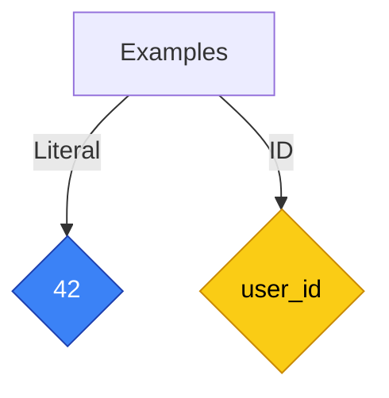

# [Graphs](/docs/Graphs/index.md)
## Notation Used in This Document
Any node marked in a diamond is a literal (blue) or an ID (yellow). Anything in a purple square block is added notation that does not signify anything in the literal graph itself:

## Basics
### Directed Vs Undirected
### Trees
## Knowledge Graphs
## LLMs as Graphs
### Vectors
### Tokens
#### Token-Phoneme Overlap?
* Phonology as sub-syntax?
