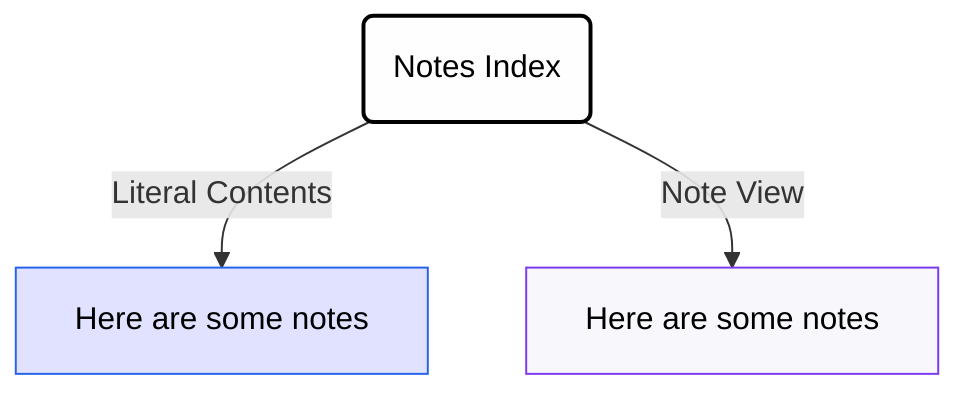
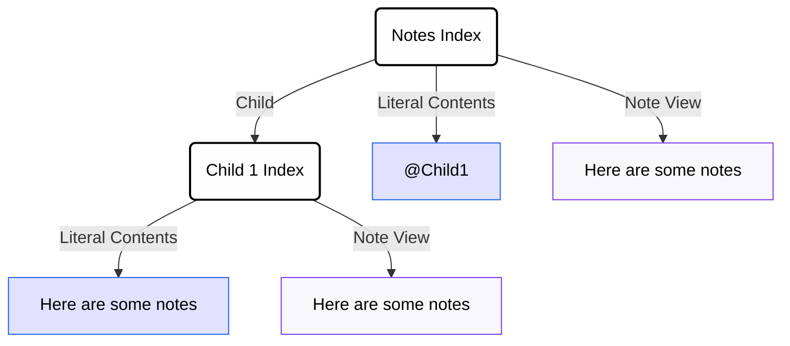
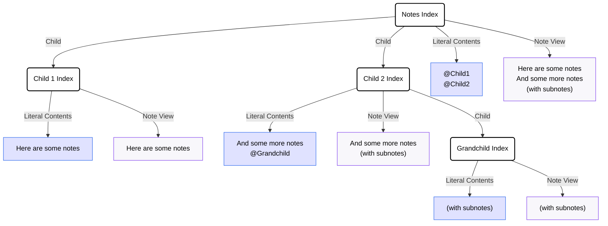

# Pseudo-Hierarchical Graphs

## Example Using Notes
### Simplest Version (Literals only)

```mermaid
flowchart TD
NI("Notes Index"):::index
NILC["Here are some notes"]:::literal
NINV["Here are some notes"]:::display

NI --> |Literal Contents| NILC
NI --> |Note View| NINV


classDef display fill:#f8f7fb,stroke:#7c3aed,color:#000;
classDef literal fill:#e0e2ff,stroke:#2563eb,color:#000;
classDef index fill:#fefefe,stroke:#000,color:#000,stroke-width:2px;

```

### Slightly More Complicated (Literals and Single Parent Reference)

```mermaid
flowchart TD
NI("Notes Index"):::index
C1("Child 1 Index"):::index
C1LC["Here are some notes"]:::literal
C1NV["Here are some notes"]:::display
NILC["@Child1"]:::literal
NINV["Here are some notes"]:::display


NI --> |Child| C1
NI --> |Literal Contents| NILC
NI --> |Note View| NINV
C1 --> |Literal Contents|C1LC
C1 --> |Note View|C1NV


classDef display fill:#f8f7fb,stroke:#7c3aed,color:#000;
classDef literal fill:#e0e2ff,stroke:#2563eb,color:#000;
classDef index fill:#fefefe,stroke:#000,color:#000,stroke-width:2px;
```

### Upping the Complication

```mermaid
%%{init: {'flowchart': {'htmlLabels': true}}}%%

flowchart TD
NI("Notes Index"):::index
C1("Child 1 Index"):::index
C1LC["Here are some notes"]:::literal
C1NV["Here are some notes"]:::display

C2("Child 2 Index"):::index
C2LC["And some more notes<br>@Grandchild"]:::literal
C2NV["And some more notes<br>(with subnotes)"]:::display
C3("Grandchild Index"):::index
C3LC["(with subnotes)"]:::literal
C3NV["(with subnotes)"]:::display
NILC["@Child1<br>@Child2"]:::literal
NINV["Here are some notes<br>And some more notes<br> (with subnotes)"]:::display


NI --> |Child| C1
NI --> |Literal Contents| NILC
NI --> |Note View| NINV
C1 --> |Literal Contents|C1LC
C1 --> |Note View|C1NV
NI --> |Child| C2
C2 --> |Child| C3
C2 --> |Literal Contents|C2LC
C2 --> |Note View|C2NV
C3 --> |Literal Contents|C3LC
C3 --> |Note View|C3NV


classDef display fill:#f8f7fb,stroke:#7c3aed,color:#000;
classDef literal fill:#e0e2ff,stroke:#2563eb,color:#000;
classDef index fill:#fefefe,stroke:#000,color:#000,stroke-width:2px;
```
